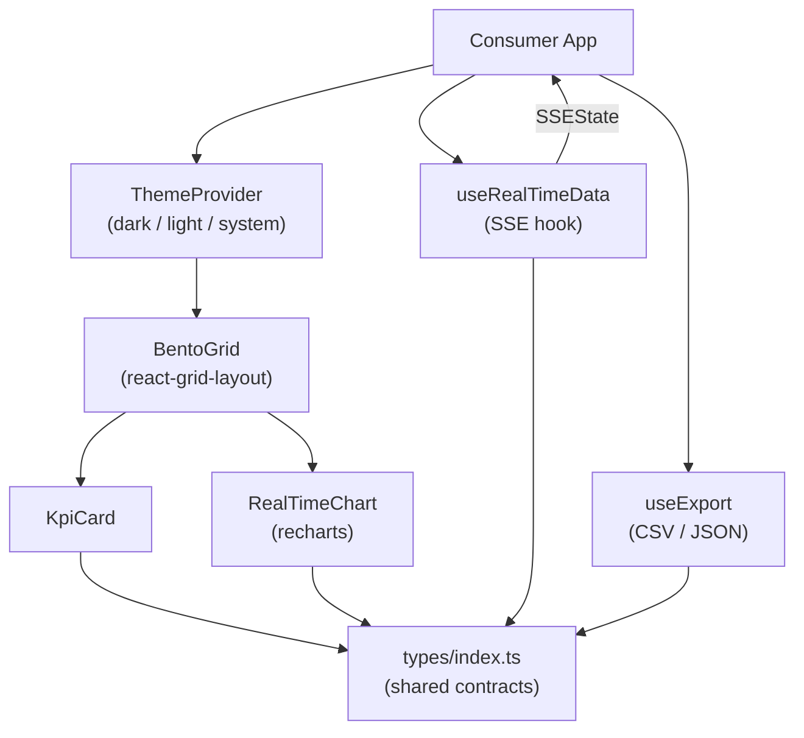

# @itiana/dashboard-kit

Real-time dashboard component library for React. Drop-in BentoGrid with drag-and-drop, live KPI cards, streaming charts via SSE, and a dark/light theme system – all in one package with zero required configuration.

## Use Cases

- **Ops dashboards** – connect a single SSE endpoint and render live metrics without writing any streaming logic
- **Analytics UIs** – compose KPI cards and recharts-based line/bar/area charts inside a freely rearrangeable grid
- **Monitoring panels** – threshold-aware status colors, progress-to-target bars, and trend arrows out of the box
- **Data exports** – one hook call to download displayed data as CSV or JSON

## Architecture



## Tech Stack

| Layer | Library |
|---|---|
| Framework | React 18 + TypeScript 5 (strict) |
| Charts | recharts 2 |
| Grid | react-grid-layout 1 |
| State | zustand 4 (optional) |
| Build | Vite 5 (library mode) + vite-plugin-dts |
| Tests | Vitest 2 + React Testing Library 16 |

## Install

```bash
npm install @itiana/dashboard-kit recharts react-grid-layout
```

Peer deps: `react ^18`, `react-dom ^18`.

## Quick Start

```tsx
import {
  ThemeProvider,
  BentoGrid,
  KpiCard,
  RealTimeChart,
  useRealTimeData,
} from '@itiana/dashboard-kit';
import type { Widget, WidgetLayout, KpiValue, ChartDataPoint } from '@itiana/dashboard-kit';

const widgets: Widget[] = [
  { id: 'w1', type: 'kpi', title: 'Active Users', config: {} },
  { id: 'w2', type: 'chart', title: 'Request Rate', config: {} },
];

const layouts: WidgetLayout[] = [
  { i: 'w1', x: 0, y: 0, w: 3, h: 2 },
  { i: 'w2', x: 3, y: 0, w: 9, h: 4 },
];

const kpi: KpiValue = {
  label: 'Active Users',
  value: 4821,
  trend: 'up',
  trendPercent: 8.4,
  status: 'good',
};

function App() {
  const { data } = useRealTimeData<ChartDataPoint[]>({
    url: '/api/metrics/stream',
  });

  return (
    <ThemeProvider defaultMode="dark">
      <BentoGrid
        widgets={widgets}
        layouts={layouts}
        renderWidget={(w) => {
          if (w.id === 'w1') return <KpiCard kpi={kpi} />;
          if (w.id === 'w2')
            return (
              <RealTimeChart
                config={{
                  series: [{ key: 'value', name: 'req/s', type: 'area' }],
                  showGrid: true,
                }}
                data={data ?? []}
              />
            );
          return null;
        }}
      />
    </ThemeProvider>
  );
}
```

## Components

### `ThemeProvider`

Wraps the app. Supports `'light' | 'dark' | 'system'`. Persists choice to `localStorage`.

```tsx
<ThemeProvider defaultMode="system" storageKey="my-theme">
  {children}
</ThemeProvider>
```

Access tokens anywhere with `useTheme()`.

### `BentoGrid`

Draggable, resizable widget grid backed by react-grid-layout.

| Prop | Type | Default |
|---|---|---|
| `widgets` | `Widget[]` | required |
| `layouts` | `WidgetLayout[]` | required |
| `renderWidget` | `(w: Widget) => ReactNode` | required |
| `cols` | `number` | `12` |
| `rowHeight` | `number` | `80` |
| `isDraggable` | `boolean` | `true` |
| `isResizable` | `boolean` | `true` |
| `onLayoutChange` | `(layouts: WidgetLayout[]) => void` | – |

### `KpiCard`

Displays a single metric with optional trend, target progress bar, and status indicator.

```tsx
<KpiCard
  kpi={{ label: 'CPU', value: 73.2, unit: '%', status: 'warning', trend: 'up', trendPercent: 4.1 }}
  onClick={() => drillDown('cpu')}
/>
```

### `RealTimeChart`

Line, area, or bar chart that accepts external data and optionally polls via `onDataRequest`.

```tsx
<RealTimeChart
  config={{
    series: [{ key: 'cpu', name: 'CPU %', type: 'line' }],
    maxPoints: 120,
    showGrid: true,
    showLegend: true,
  }}
  data={points}
  height={240}
/>
```

## Hooks

### `useRealTimeData<T>(options)`

SSE connection with unlimited auto-reconnect and exponential backoff.

```ts
const { data, isConnected, error, reconnectCount } =
  useRealTimeData<MetricPayload>({ url: '/api/stream' });
```

### `useExport()`

Download in-memory data as CSV or JSON.

```ts
const { exportData, isExporting } = useExport();

await exportData({
  data: rows,
  filename: 'report',
  format: 'csv',
  fields: ['timestamp', 'value'],
  headers: { timestamp: 'Time', value: 'Metric' },
});
```

## Scripts

```bash
npm install        # install deps
npm run typecheck  # tsc --noEmit
npm test           # vitest run (all tests)
npm run build      # vite library build → dist/
```

## License

CC BY-NC 4.0 License. Copyright (c) 2026 itiana.
