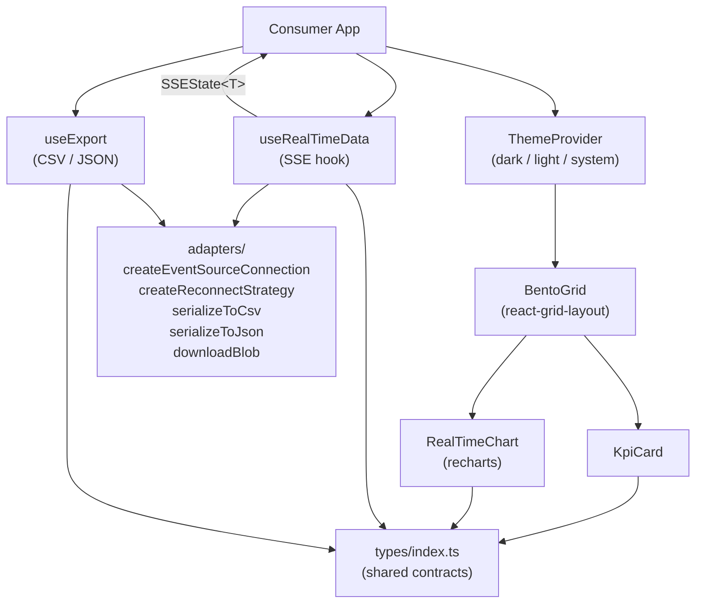

# @itiana/dashboard-kit

Real-time dashboard component library for React. Provides a drag-and-drop BentoGrid, KPI cards with trend indicators, streaming charts via SSE, a dark/light theme system, and CSV/JSON export - with zero required configuration.

## What Problem It Solves

Building a production real-time dashboard involves wiring together a streaming data layer (SSE reconnect logic, parse errors, backoff), a layout system (drag, resize, responsive columns), live charts that trim old points, and a consistent theme. This library packages all of that as typed, composable primitives so you can focus on your data rather than plumbing.

## Features

- **BentoGrid** - draggable, resizable widget grid backed by react-grid-layout
- **KpiCard** - metric display with trend arrows, target progress bar, status color, and loading skeleton
- **RealTimeChart** - line / area / bar chart (recharts) with auto-trimming ring buffer and configurable mode
- **ThemeProvider** - dark / light / system theme with `localStorage` persistence and design token injection
- **useRealTimeData** - SSE hook with exponential backoff reconnect, parse error isolation, and clean unmount
- **useExport** - download in-memory data as CSV or JSON with field selection and custom headers
- **Adapter layer** - pure, independently testable functions: `createEventSourceConnection`, `createReconnectStrategy`, `serializeToCsv`, `serializeToJson`, `downloadBlob`

## Compatibility

| Dependency         | Tested version | Notes                              |
|--------------------|----------------|------------------------------------|
| React              | 18.x           | React 19 not yet verified          |
| TypeScript         | 5.x (strict)   | Required - no plain JS builds      |
| recharts           | ^2.12          | Peer dep via `dependencies`        |
| react-grid-layout  | ^1.4           | Peer dep via `dependencies`        |
| Browsers           | Modern evergreen | No SSR / no Node.js environment  |

## Installation

```bash
npm install @itiana/dashboard-kit
```

react-grid-layout requires its CSS. Add both imports to your app entry:

```ts
import 'react-grid-layout/css/styles.css';
import 'react-grid-layout/css/animate.css';
```

## Quick Start

```tsx
import {
  ThemeProvider,
  BentoGrid,
  KpiCard,
  RealTimeChart,
  useRealTimeData,
} from '@itiana/dashboard-kit';
import type { Widget, WidgetLayout, KpiValue, ChartDataPoint } from '@itiana/dashboard-kit';

const widgets: Widget[] = [
  { id: 'w1', type: 'kpi',   title: 'Active Users',  config: {} },
  { id: 'w2', type: 'chart', title: 'Request Rate',   config: {} },
];

const layouts: WidgetLayout[] = [
  { i: 'w1', x: 0, y: 0, w: 3, h: 2 },
  { i: 'w2', x: 3, y: 0, w: 9, h: 4 },
];

const kpi: KpiValue = {
  label: 'Active Users',
  value: 4821,
  trend: 'up',
  trendPercent: 8.4,
  status: 'good',
};

function App() {
  const { data } = useRealTimeData<ChartDataPoint[]>({
    url: import.meta.env.VITE_METRICS_STREAM_URL,
  });

  return (
    <ThemeProvider defaultMode="dark">
      <BentoGrid
        widgets={widgets}
        layouts={layouts}
        renderWidget={(w) => {
          if (w.id === 'w1') return <KpiCard kpi={kpi} />;
          if (w.id === 'w2')
            return (
              <RealTimeChart
                config={{
                  series: [{ key: 'value', name: 'req/s' }],
                  mode: 'area',
                  maxPoints: 120,
                  showGrid: true,
                }}
                data={data ?? []}
              />
            );
          return null;
        }}
      />
    </ThemeProvider>
  );
}
```

## Architecture



## Components API

### `ThemeProvider`

Must wrap the component tree. Supports `'light' | 'dark' | 'system'`. Persists choice to `localStorage`.

```tsx
<ThemeProvider defaultMode="system" storageKey="my-theme">
  {children}
</ThemeProvider>
```

Access theme tokens and controls anywhere with `useTheme()`.

| Prop          | Type                      | Default       |
|---------------|---------------------------|---------------|
| `defaultMode` | `'light' \| 'dark' \| 'system'` | `'system'` |
| `storageKey`  | `string`                  | `'theme'`     |
| `children`    | `ReactNode`               | required      |

### `BentoGrid`

Draggable, resizable widget container. **Requires react-grid-layout CSS** (see Installation).

| Prop             | Type                                | Default  |
|------------------|-------------------------------------|----------|
| `widgets`        | `Widget[]`                          | required |
| `layouts`        | `WidgetLayout[]`                    | required |
| `renderWidget`   | `(w: Widget) => ReactNode`          | required |
| `cols`           | `number`                            | `12`     |
| `rowHeight`      | `number`                            | `80`     |
| `isDraggable`    | `boolean`                           | `true`   |
| `isResizable`    | `boolean`                           | `true`   |
| `onLayoutChange` | `(layouts: WidgetLayout[]) => void` | –        |

### `KpiCard`

Displays a single metric with optional trend indicator, target progress bar, status color, and loading skeleton.

```tsx
<KpiCard
  kpi={{
    label: 'CPU',
    value: 73.2,
    unit: '%',
    status: 'warning',
    trend: 'up',
    trendPercent: 4.1,
    target: 100,
  }}
  onClick={() => drillDown('cpu')}
/>
```

| Prop      | Type                    | Default |
|-----------|-------------------------|---------|
| `kpi`     | `KpiValue`              | required |
| `loading` | `boolean`               | `false` |
| `onClick` | `() => void`            | –       |

When `onClick` is provided, the card renders as a `<button>` element.

### `RealTimeChart`

Renders a recharts chart that auto-trims its ring buffer to `maxPoints`.

```tsx
<RealTimeChart
  config={{
    series: [{ key: 'cpu', name: 'CPU %' }],
    mode: 'line',       // 'line' | 'area' | 'bar'
    maxPoints: 120,
    showGrid: true,
    showLegend: true,
    yAxisDomain: [0, 100],
    animate: false,
  }}
  data={points}
  height={240}
/>
```

| Prop            | Type                     | Default  |
|-----------------|--------------------------|----------|
| `config`        | `RealTimeChartConfig`    | required |
| `data`          | `ChartDataPoint[]`       | required |
| `height`        | `number`                 | `300`    |
| `onDataRequest` | `() => ChartDataPoint \| null` | –  |
| `className`     | `string`                 | –        |

`config.mode` overrides per-series `type`. When `mode` is omitted, the chart type is auto-detected from the series array.

## Hooks API

### `useRealTimeData<T>(options): SSEState<T>`

Opens an SSE connection and manages reconnect with exponential backoff + jitter. Closes cleanly on unmount.

```ts
const { data, isConnected, error, reconnectCount } =
  useRealTimeData<MetricPayload>({
    url: import.meta.env.VITE_STREAM_URL,
    maxReconnectAttempts: 10,
    reconnectInterval: 1000,
    parseMessage: (raw) => JSON.parse(raw) as MetricPayload,
  });
```

SSE option contract (`SSEOptions<T>`):

| Field                  | Type                        | Default |
|------------------------|-----------------------------|---------|
| `url`                  | `string`                    | required |
| `withCredentials`      | `boolean`                   | `false` |
| `reconnectInterval`    | `number` (ms)               | `1000`  |
| `maxReconnectAttempts` | `number`                    | `10`    |
| `parseMessage`         | `(raw: string) => T`        | `JSON.parse` |
| `onOpen`               | `() => void`                | –       |
| `onError`              | `(e: Event) => void`        | –       |

`error` is typed as `RealtimeError`:

```ts
type RealtimeError =
  | { type: 'transport'; message: string }
  | { type: 'parse';     message: string; rawData?: string }
  | { type: 'configuration'; message: string };
```

### `useExport(): UseExportReturn`

Downloads in-memory typed data as CSV or JSON.

```ts
const { exportData, isExporting, error } = useExport();

await exportData({
  data: rows,
  filename: 'report',
  format: 'csv',
  fields: ['timestamp', 'value'],
  headers: { timestamp: 'Time', value: 'Metric' },
});
```

`ExportOptions<T>` contract:

| Field      | Type                              | Default    |
|------------|-----------------------------------|------------|
| `data`     | `T[]`                             | required   |
| `filename` | `string`                          | `'export'` |
| `format`   | `'csv' \| 'json'`                 | `'csv'`    |
| `fields`   | `(keyof T)[]`                     | all keys   |
| `headers`  | `Partial<Record<keyof T, string>>` | field names |

## SSR / Next.js Notes

This library is **browser-only**. It uses `EventSource`, `document`, `URL.createObjectURL`, and `localStorage`. Do not render any component or call any hook during server-side rendering. Use dynamic imports with `ssr: false` in Next.js:

```ts
const BentoGrid = dynamic(() => import('@itiana/dashboard-kit').then(m => m.BentoGrid), {
  ssr: false,
});
```

## Accessibility

- `KpiCard` renders as a `<button>` with `type="button"` when `onClick` is provided, enabling keyboard activation.
- Progress bars use `role="progressbar"` with `aria-valuenow`, `aria-valuemin`, and `aria-valuemax`.
- Loading skeletons set `aria-busy="true"` on the container.
- Theme tokens expose sufficient contrast ratios for dark and light modes.

## Known Constraints

- React 19 compatibility is not verified - use React 18.
- No SSR / no Node.js environment support.
- `useRealTimeData` reconnects up to `maxReconnectAttempts` times; after exhaustion it stops retrying and leaves `error` set.
- `BentoGrid` requires react-grid-layout CSS to be imported manually in the consumer app.
- The library has no built-in virtualization; very large widget counts (>50) may affect grid performance.

## Development

```bash
npm install        # install all deps including devDependencies
npm run typecheck  # tsc --noEmit - must pass before committing
npm test           # vitest run - all unit tests
npm run build      # vite library build → dist/
npm run lint       # eslint src __tests__
```

## Release Status

Current version: **0.1.0-alpha**. Public API may change before 1.0.

## License

MIT - see [LICENSE](./LICENSE)
